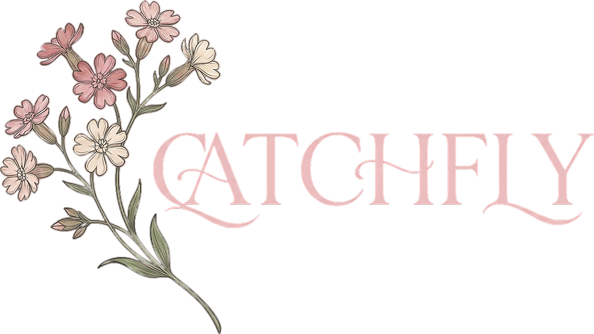
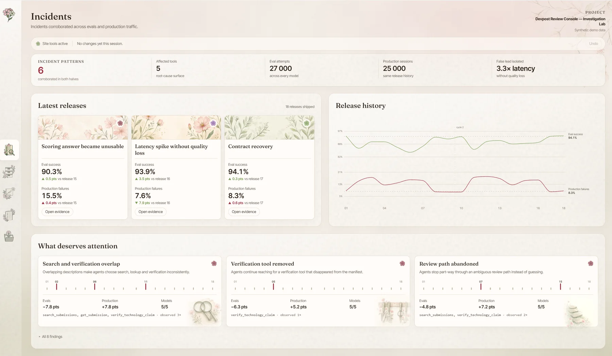
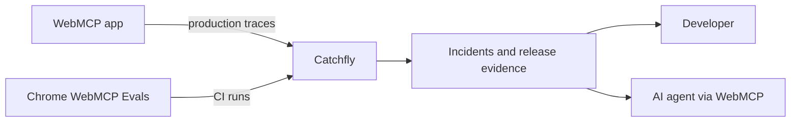

<div align="center">
  
  <p><strong>See what agents do with your WebMCP app.</strong></p>
  <p>
    Capture production traces, run Chrome WebMCP Evals from CI, and find regressions
    across app, model and tool versions.
  </p>
  <p>
    
    
    
    <a href="./LICENSE"></a>
  </p>
  <p>
    <a href="https://catchfly.dev">Website</a> ·
    <a href="https://catchfly.dev/w/9f2c7a41">Investigation Lab</a> ·
    <a href="./docs/self-hosting.md">Self-hosting</a>
  </p>
</div>



Chrome executes the evals. Catchfly keeps every run and brings the results together
with production traces, so you can see what changed and why.

An eval score tells you that something failed. Catchfly follows the failure through
the release that introduced it, the tool manifest that changed, and the production
sessions where agents encountered it. The result is an investigation you can inspect
and turn into a permanent test.

Built for the [WebMCP Challenge](https://webmcp.devpost.com).

## Follow the evidence

Catchfly gives each release one continuous record across offline evaluation and
production behavior.

| View | What it answers |
| --- | --- |
| Incidents | Which changes hurt both eval success and production outcomes? Do models agree? Is the largest latency spike a real regression or a false lead? |
| Releases | What changed between two deployments? Which tools lost execution success, and how did their descriptions or schemas change? |
| Sessions | What did an agent actually call, in what order, with which arguments and result? |
| Evals | Which cases regressed, where did their trajectories diverge, and did the recovery hold across repeated runs? |



Production and eval data stay separate until there is evidence to connect them. A
deployment points to the app version it served. That join lets Catchfly trace a change
in agent behavior back to the tool contract that was live at the time.

Catchfly also keeps execution success separate from task success. A tool may return
successfully while the agent still fails the request. Missing measurements remain
unknown instead of quietly becoming zero.

## Investigate with an agent

Catchfly exposes its own workspace through WebMCP. An agent can read incidents,
compare releases, filter cases, and open the relevant session on the same page the
developer is viewing.

Human clicks and agent tools call the same store actions. Changes are attributed in
the interface, and navigation
tools return the resulting state so the agent can verify what is now on screen.

The most consequential workflow is scoped to the session being reviewed. Catchfly can
prepare an eval case from a production trace, show the exact draft, and save it only
after explicit approval. The case records its source session, preserving the reason
the test exists.

To try the site tools, open the deployed workspace in the built-in browser in the
ChatGPT desktop app. The regular interface continues to work in browsers without
WebMCP support.

## Run Catchfly locally

Catchfly requires Node.js 22 or newer.

```bash
npm install
cp .env.example .env
npm run dev
```

On PowerShell, use `Copy-Item .env.example .env`. The template explicitly enables open local mode;
Internet-facing deployments should set `CATCHFLY_AUTH_MODE=supabase`.

Open [http://localhost:5173/w/9f2c7a41](http://localhost:5173/w/9f2c7a41) to enter
the bundled Investigation Lab. It contains a deterministic, read-only project with
release cycles, production-style sessions, eval runs, and a deliberate latency-only
false lead.

Useful development commands:

```bash
npm run build       # typecheck and build the packages and web app
npm run smoke       # run the offline contract and data checks
npm run lint        # run oxlint
npm run mock        # validate the synthetic investigation world
```

## Connect a WebMCP app

Create a project and runtime key in `Project settings → Connection`, then add the
Catchfly SDK to the application that executes your WebMCP tools.

```ts
import { Catchfly, instrumentWebMCP } from '@catchfly/sdk';

const catchfly = new Catchfly({
  endpoint: 'https://catchfly.example.com',
  projectId: 'checkout',
  environmentId: 'production',
  apiKey: import.meta.env.VITE_CATCHFLY_INGEST_KEY,
  deployment: {
    id: import.meta.env.VITE_DEPLOYMENT_ID,
    appVersionId: import.meta.env.VITE_APP_VERSION,
  },
});

instrumentWebMCP(catchfly); // call before registering your WebMCP tools
```

Automatic instrumentation records tool calls but leaves the task outcome unknown. Use the manual
session API when your application can report a measured success or failure. The SDK batches events
in memory and uses bounded retries, so Catchfly availability never becomes a dependency of the
agent's task. See the
[`@catchfly/sdk` documentation](./packages/sdk/README.md) for delivery behavior and
shutdown handling.

## Run Chrome WebMCP Evals from CI

Create an eval key for the project. Pull cases reviewed from real traces into source control, then
let the Catchfly CLI run the Chrome suite and upload its report.

```bash
npx @catchfly/cli eval pull evals.json \
  --endpoint https://catchfly.example.com \
  --project checkout \
  --key "$CATCHFLY_EVAL_KEY"
```

```bash
npx @catchfly/cli eval run \
  --url https://my-app.example.com \
  --evals evals.json \
  --endpoint https://catchfly.example.com \
  --project checkout \
  --version "$GIT_SHA" \
  --key "$CATCHFLY_EVAL_KEY" \
  --min-success-rate 0.90
```

The optional success-rate threshold turns the run into a CI quality gate. A failing
gate still uploads its evidence, so the result is available for investigation. Existing
JSON reports can be sent with `catchfly eval upload`. See the
[`@catchfly/cli` documentation](./packages/cli/README.md) for all three commands.

## Self-host with Docker

Catchfly ships as a single-organization application backed by PostgreSQL.

```bash
export CATCHFLY_ADMIN_KEY="replace-with-a-long-random-secret"
docker compose up --build
```

Open [http://localhost:8888/w/9f2c7a41](http://localhost:8888/w/9f2c7a41). The
container applies pending migrations before it starts. `/health/live` checks the
process; `/health/ready` checks PostgreSQL and the migration registry.

The [self-hosting guide](./docs/self-hosting.md) covers secure deployment and
day-to-day operations.

## Repository map

| Path | Purpose |
| --- | --- |
| [`apps/web`](./apps/web) | React workspace, product UI, and Catchfly's WebMCP tools |
| [`packages/sdk`](./packages/sdk) | Runtime telemetry SDK for WebMCP applications |
| [`packages/cli`](./packages/cli) | Chrome eval runner and report uploader for CI |
| [`packages/core`](./packages/core) | Data model and deterministic analysis primitives |
| [`packages/webmcp`](./packages/webmcp) | WebMCP types, tool registration, and result shaping |
| [`db/migrations`](./db/migrations) | PostgreSQL schema and forward migrations |
| [`examples/webmcp-vite`](./examples/webmcp-vite) | Minimal SDK-to-eval integration reference |

The WebMCP tools live in [`apps/web/src/webmcp`](./apps/web/src/webmcp). Read tools
query the same deterministic layer as the interface. Tools that move the workspace use
the same Zustand actions as human navigation. Selecting a case or session adds
context-specific tools for that record.

## Data and provenance

The bundled Investigation Lab is synthetic and labeled as such throughout the product.
Its releases, manifests, eval attempts, and production-style sessions come from one
deterministic world, which makes the relationships inspectable without presenting
generated data as production evidence.

Measured projects accept runtime telemetry and Chrome eval reports through separate,
scoped keys. Redaction rules run before telemetry reaches storage. Project keys are
stored as SHA-256 digests, and the runtime SDK should never receive an admin or eval
write key.

## License

[MIT](./LICENSE)
